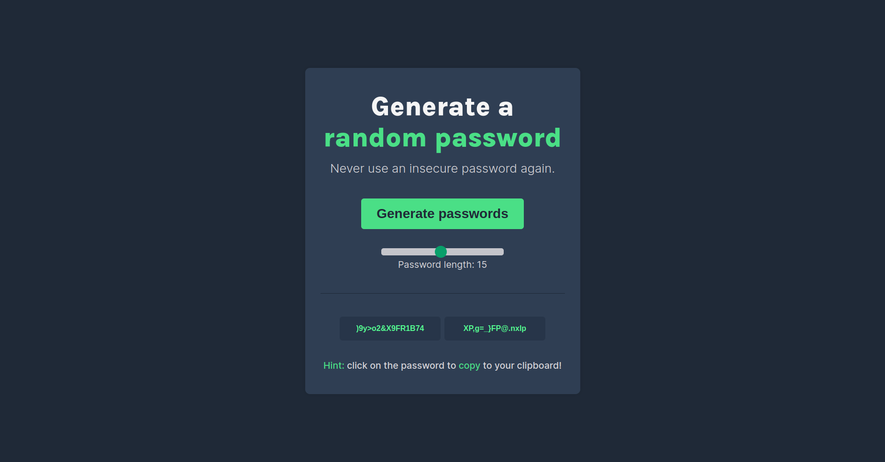

# Scrimba Password Generator

This project is a password generator built as part of the [Scrimba's Learn JavaScript course](https://v2.scrimba.com/learn-javascript-c0v). The password generator allows users to create strong, random passwords of variable length. The application is built using HTML, CSS, and JavaScript.

## Website Link

Visit the live website [here](https://paulomborges.github.io/scrimba-js-password-generator/).

## Features

- **Random Password Generation**: Generate two random passwords with a single click.
- **Password Length Adjustment**: Adjust the length of the passwords using a slider.
- **Clipboard Copy**: Click on a generated password to copy it to the clipboard.
- **Responsive Design**: Works well on both desktop and mobile devices. 

